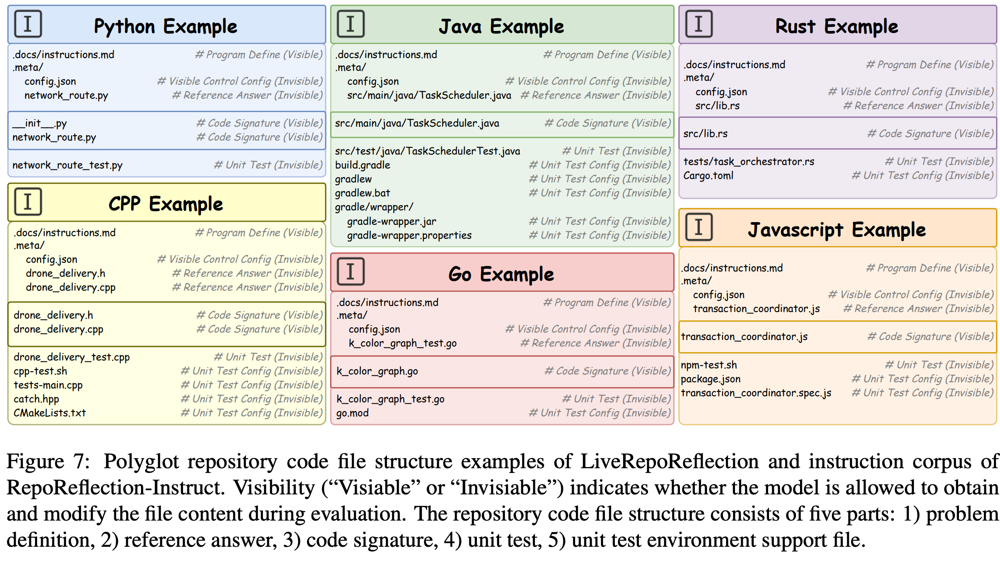

# Turning the Tide: Repository-based Code Reflection

[](LICENSE)
 
This repository contains the benchmark data for **LiveRepoReflection**, a project designed to evaluate the ability of Code Large Language Models (LLMs) to understand, modify, and reflect upon code within a multi-file repository context.

For the full evaluation framework, data generation pipeline, and research paper, please visit the main project repository: [LiveRepoReflection/LiveRepoReflection-Project](https://github.com/LiveRepoReflection/LiveRepoReflection-Project).

## Benchmark Data Structure
 
The benchmark data is organized by programming language. Each language directory contains a set of test cases, where each test case is a self-contained programming problem within its own directory.

We provide directory structure example for six programming language.

<center>
    
    <br>
    <div style="color:orange; border-bottom: 1px solid #d9d9d9;
    display: inline-block;
    color: #999;
    padding: 2px;"></div>
</center>

The directory structure is as follows:
```
  .
  ├── cpp/
  │   └── exercises/practice/
  │       └── <uuid_id>/<test_case_id>/
  │           ├── .docs/
  │           ├── .meta/
  │           ├── <source_files>.cpp
  │           └── <test_files>.cpp
  ├── go/
  │   └── exercises/practice/
  │       └── <uuid_id>/<test_case_id>/
  │           ├── .docs/
  │           ├── .meta/
  │           ├── <source_files>.go
  │           └── <test_files>.go
  ├── java/
  │   └── exercises/practice/
  │       └── <uuid_id>/<test_case_id>/
  │           └── src/
  │               ├── main/java/
  │               └── test/java/
  ├── javascript/
  │   └── exercises/practice/
  │       └── <uuid_id>/<test_case_id>/
  │           ├── .docs/
  │           ├── .meta/
  │           ├── <source_files>.js
  │           └── <test_files>.js
  ├── python/
  │   └── exercises/practice/
  │       └── <uuid_id>/<test_case_id>/
  │           ├── .docs/
  │           ├── .meta/
  │           ├── <source_files>.py
  │           └── <test_files>.py
  └── rust/
      └── exercises/practice/
          └── <uuid_id>/<test_case_id>/
              ├── .docs/
              ├── .meta/
              └── src/
                  ├── lib.rs
                  └── main.rs
```


### Inside a Test Case

Each `<test_case_id>` directory represents a unique problem and contains:

 *   **Source Files**: One or more source code files (e.g., `network_distance.py`) that contain the code to be analyzed or modified by the LLM.
 *   **Test Files**: Corresponding unit test files (e.g., `network_distance_test.py`) that define the correctness criteria for the task. The LLM's goal is to modify the source files so that these tests pass.
 *   **.docs/**: (Optional) Directory containing documentation or hints related to the problem.
 *   **.meta/**: (Optional) Directory containing metadata about the test case.

 ## How to Use the Benchmark
 
To run the evaluation using this data, please use the automated framework provided in the [LiveRepoReflection-Project](https://github.com/LiveRepoReflection/LiveRepoReflection-Project) repository. Please refer to the `README.md` in the main project repository for detailed instructions on running the benchmarks.

 ## How to Cite
 
 If you use `LiveRepoReflection` in your research, please cite our paper:

```bibtex
@misc{zhang2025LiveRepoReflection,
      title={Turning the Tide: Repository-based Code Reflection}, 
      author={Wei Zhang and Jian Yang and Jiaxi Yang and Ya Wang and Zhoujun Li and Zeyu Cui and Binyuan Hui and Junyang Lin},
      year={2025},
      eprint={2507.09866},
      archivePrefix={arXiv},
      primaryClass={cs.SE},
      url={https://arxiv.org/abs/2507.09866}, 
}
```
